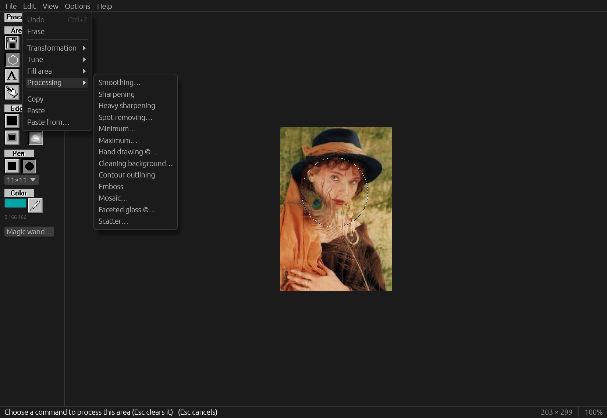

# Picture Man

A cross-platform rebuild of **Picture Man 1.55** (1991–1993), the true-color
image processing tool for Windows 3.x by Igor 'Potapov' Plotnikov, Mike
Kuznetsov and Alex Bobkov (Potapov WORKS, STOIK Ltd.).

No source code survived. The algorithms were recovered by disassembling
PMAN.EXE and its converter DLLs; see [`re/`](re/README.md) for the recovered
specs, with original addresses and pseudocode, and the tools used.



## Try it in your browser

**https://yovico-ai.github.io/pictureman/** runs the same code compiled to
WebAssembly, inside the browser's sandbox; nothing is installed. Files are
opened with the browser's file picker and saved as downloads. (The
clipboard and settings are desktop-only.)

## Install

There are no prebuilt binaries: build it from source with
[Rust](https://rustup.rs) 1.94 or newer.

```
cargo install --git https://github.com/yovico-ai/pictureman
pictureman [image files…]
```

Or from a checkout: `cargo run --release -- [image files…]`.

The web version builds with [trunk](https://trunkrs.dev):
`rustup target add wasm32-unknown-unknown`, `cargo install trunk`, then
`trunk serve` (or `trunk build --release`).

## Using it

1. **Select** with a tool from the toolbox: rectangle (M), ellipse (E),
   polygon (P), lasso (L), magic wand (W) or text (T). The selection stays
   until you clear it: Shift adds to it, Alt subtracts, dragging inside moves
   it; Select ▸ All / None / Invert (Ctrl+A, Ctrl+D, Ctrl+Shift+I). The
   "whole image" button (or Esc) clears it.
2. **Apply** any command from Image, Adjust, Fill or Filters: it works on the
   selection — with the soft edge chosen under Edge — or on the whole image
   when nothing is selected. Dialogs preview the result live on the image.
3. **Paint with any operation** (Picture Man's signature): pick the brush
   (B), then choose any Adjust, Fill or Filters command — it becomes what the
   brush paints with. The right button restores the original; painting stays
   inside the selection.

In 1.55 the order was the other way round — command first, then the area,
then a double-click inside or outside it. "Outside" is Select ▸ Invert now.

Settings are kept in `pictureman.ini` (same sections and keys as PMAN.INI).

## What is there

- The original menu tree, toolbox bitmaps, logo and workflow: choose a
  command, outline an area, double-click **inside** or **outside** it.
- Areas: whole image, rectangle, ellipse, polygon, text, magic wand
  (RGB/HSV, Unifold), freehand, and the pen, which paints with any operation.
- Edges: sharp and smooth low/medium/high, using the original quarter-sine
  run-length weights. With the pen, the edge level sets the pen's opacity.
- Transformation: Size, Clip, Move (Clone with the pen), Flip, Rubber, the
  11 Deformations, Rotate. Transformed fragments can be moved and resized
  before accepting them.
- Tune: TV and Linear RGB control, Gamma, Expand, Equalization.
- Fill: plain and fluctuated color, three gradients, three pattern modes,
  and the three Patch modes.
- Processing: Smoothing, (Heavy) sharpening, Spot removing, Minimum,
  Maximum, Hand drawing, Cleaning background, Contour outlining, Emboss,
  Mosaic, Faceted glass, Scatter.
- Copy and Paste via the system clipboard, Paste from file (with black/white
  level transparency), Erase, multi-level Undo, and several open images.
- Formats: BMP, GIF, TIFF, JPEG, TARGA, PCX, PNG, and EPS (written in
  the original EPI layout).

Dropped: TWAIN/frame-grabber acquisition, the color/dither display
options (1993 hardware) and raw byte-array files. Not rebuilt: printing, monitor gamma, "Paint on
icon", and the converter-DLL plug-in interface.

## Fixed bugs of the original

The algorithms follow the original exactly, except for these bugs found
while reverse engineering. Each fix is noted at the function; the
original's behaviour is in `../re/specs/`.

- Sliding-window filters and effects never read the image's last column,
  and near an area's left edge their results depended on the area.
- Cleaning background overflowed a 16-bit sum (bright areas went dark).
- Sharpening and Heavy sharpening mirrored negative values with `abs()`
  (dark sides of edges came out bright).
- Spot removing took the 4th of 9 values instead of the median.
- Emboss was off by one pixel, differently in the area's first column.
- Mosaic sampled one pixel right of the tile centre.
- RGB control (TV, Linear) worked in 6-bit HSV, so even "no change"
  altered the image, and raising saturation turned greys red.
- Luminance weighted blue above red (R and B swapped by BGR order), and
  Expand used a different statistic for selections than for the whole image.
- Whole-image Rotate dropped `abs()` in the output size: angles outside
  0–90° cropped or failed.
- Vertical wave used the area's x origin instead of its y origin.
- Patch read past the image at the area's right edge and last row, wrapped
  instead of clamping, and ignored one-row selections.
- Smooth edges narrower than one pixel (e.g. Smooth low on a rectangle under
  20 px) made the operation do nothing; freehand feathers used the width only.
- A circular pen un-painted earlier strokes in the corners of each dab.

## Robustness

The original used small fixed buffers (`../re/specs/buffer_overruns.md`).
For example, the converter path was built in a 64-byte stack buffer, so
installing PMAN in a deep folder crashed File/Open. The rebuild has no
fixed-size path or string buffers, and:

- validates every file header before allocating, including PCX
  bytes-per-line against the width (the original READPCX heap overrun);
- caps image sizes at 100 megapixels with checked arithmetic;
- decodes with allocation limits;
- runs operations on a worker thread, so even an unexpected panic only
  cancels that operation.

`tests/robustness.rs` fuzzes every format and runs every operation over
edge-case sizes, regions, parameters and pen positions, in debug builds
(with overflow checks) too. It also exercises paths longer than 1,500
characters with non-ASCII names and dots in folder names. The program has
also been run from a 2,000-character folder, opening and saving an image
there.
